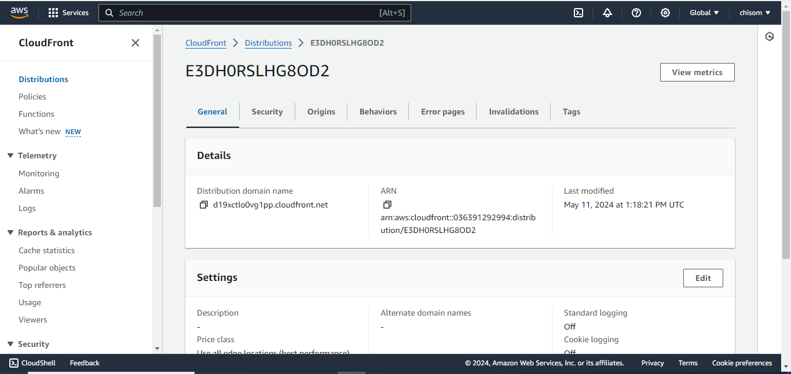
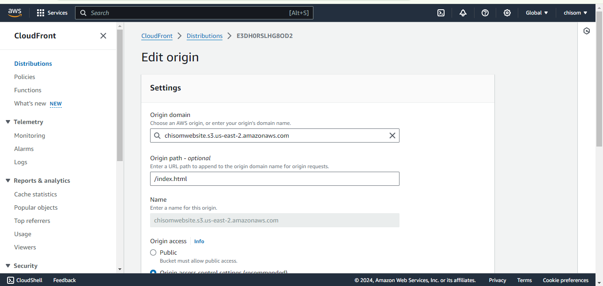

# Assignment 1

## Question
Create a static website and host it on S3 bucket(private bucket) but with public read policy assigned, using cloud front for CDN.
Screenshots of your Aws account bearing your name.
Input your steps and screenshots in your README file on GitHub.

## Solution
1. Create AWS S3 bucket

2. Upload html file

3. Allow public access on bucket

4. Enable static hosting for the bucket and set index path.

5. Create a cloudfront distribution.

6. Set S3 bucket as origin domain and create origin access control settings. Copy the generated policy to the s3 bucket

~~~
{
    "Version": "2008-10-17",
    "Id": "PolicyForCloudFrontPrivateContent",
    "Statement": [
        {
            "Sid": "AllowCloudFrontServicePrincipal",
            "Effect": "Allow",
            "Principal": {
                "Service": "cloudfront.amazonaws.com"
            },
            "Action": "s3:GetObject",
            "Resource": "arn:aws:s3:::chisomwebsite/*",
            "Condition": {
                "StringEquals": {
                    "AWS:SourceArn": "arn:aws:cloudfront::036391292994:distribution/E3DH0RSLHG8OD2"
                }
            }
        }
    ]
}
~~~

7. Access the static webpage with the cloudfront domain.

